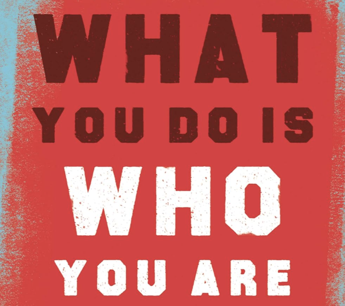
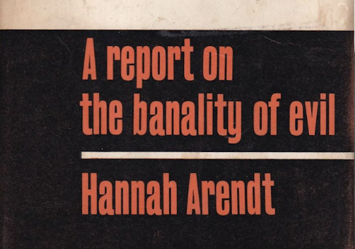
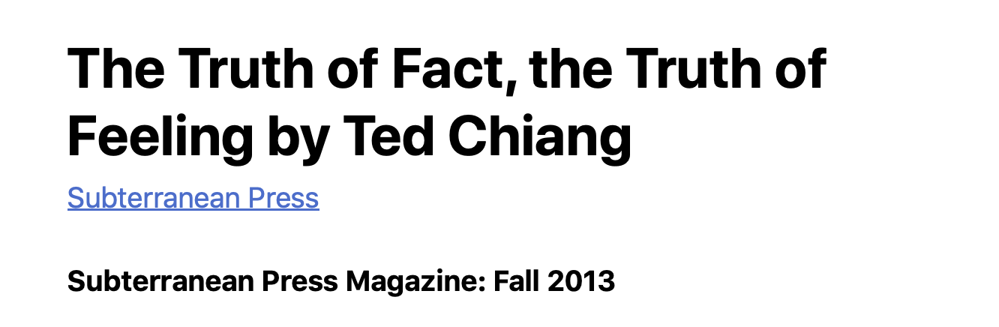

---

date: 2025-10-08 

---

# 3 books I never read, whose titles had a big impact on me.

This book is probably about business culture or something but the title made me think about the fact that there's a sense in which you're so much more than what you do, but there's also a sense in which that's *all* you are.

Your actions, how you treat others and your impact say a lot more about you than whatever's going on in your mind. You might be able to reason away the bad stuff, only try to make people see the good stuff but at the end of the day, What You Do Is Who You Are.

This book is apparently about Hannah Arendt's observations of Adolf Eichmann's trial - but I've never read it, so I can't tell you that for sure. 

Its title got me thinking about the fact that evil exists but rarely in the villainesque form - in fact, in almost all cases the evil-doer thinks what they're doing is good and moral.

I try very hard to be good but I'm also aware that most evil is probably perpetuated by people with similar aims.

No evil person ever thought they were evil, they just did what was expected of them, what they thought was good. 

That is The Banality of Evil.

This isn't even a book, it's a short story. And I also actually read it. But let's ignore all of that because I was thinking of it lately for reasons unrelated to its actual content. 

I love the poem [Raglan Road](https://www.youtube.com/watch?v=745CbIB_F5E) by Patrick Kavanagh, and its cover by Luke Kelly and The Dubliners.

It's a love song from the perspective of a man who feels betrayed and abandoned by a woman he gave his heart to. The writer leaves you with the impression of a ghoulish woman who played him for a fool, benefiting from his affection and love before carelessly abandoning him.

I always like to understand the story behind songs I like and I looked it up.

According to her, they never even dated. Her side gives the impression of a creepy old man who was obsessed with her. 

I was wondering if this should ruin the song for me and it did for a little bit, but then I realized that there was still a deep emotional truth to it, even if it may not have been grounded in factual truth. That is The Truth of Fact and the Truth of Feeling.

So, I'll leave you with Luke Kelly's rendition of this song:

[LINK]

And here's my Japanese Irish folk fusion sea-shanty version of it:

[YOUTUBE LINK]