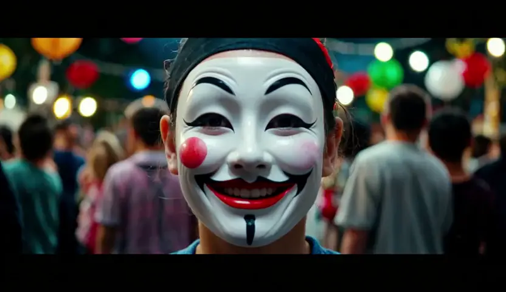

# How cool is open source? 

A few months ago, I shared a workflow for travelling between images in the #wan_resources channel on Banodoco.

It wasn't much, I just made it easier to follow best practices with VACE masking and shared an example of it implemented:

<video width="100%" controls>
  <source src="../assets/Untitled_1280_x_512_px_3.mp4" type="video/mp4">
  Your browser does not support the video tag.
</video>

Thankfully, people found it useful and since then, the thread has evolved into a hub for people exploring video extension - with lots of smart, motivated nerds trying different approaches, and sharing it for everyone to learn from and be inspired by.

Recently, in the thread, AbleJones did a very, very deep dive into the magic of RES4LYF, a node-pack for Comfy.

In short, ClownsharkBatwing has been building RES4LYF - the most insane ComfyUI nodepack with all kinds of advanced sampling options for stretching video and image models beyond their conventional limits:

<iframe width="560" height="315" src="https://www.youtube.com/embed/905eOl0ImrQ" title="YouTube video player" frameborder="0" allow="accelerometer; autoplay; clipboard-write; encrypted-media; gyroscope; picture-in-picture; web-share" allowfullscreen></iframe>

AbleJones spent a lot of time understanding this, testing every sampler that Clownshark offers, and presenting the results and workflow nicely for others to learn from:

<video width="100%" controls>
  <source src="../assets/rapidsave.com_very_useful_comparison_between_119_res4lyf-q2b73w7pflqf1.mp4" type="video/mp4">
  Your browser does not support the video tag.
</video>

This inspired and empowered TheShadow to keep investigating, who in turn figured out how to optimise the settings even further:

<video width="100%" controls>
  <source src="../assets/VaceCont_Final_00001_2.mp4" type="video/mp4">
  Your browser does not support the video tag.
</video>

This included implementing [Banostasis](https://huggingface.co/Cseti/wan2.2-14B-Kinestasis_concept-lora-v1) -a LoRA that Cseti trained - in a novel way trained to increase the amount of motion.

As a product of their collected work, with just 4 sampling steps, they've collectively overcome a common issue with distilling Wan 2.2 to run faster on consumer hardware: the slow motion effect. They've also kept CFG high enough that it's still promptable, solving another common issue with distillation.

Some of what TheShadow has shared has been beautiful:

<video width="100%" controls>
  <source src="../assets/Wan22_I2V_ClownShark__00011.mp4" type="video/mp4">
  Your browser does not support the video tag.
</video>

<video width="100%" controls>
  <source src="../assets/Wan22_I2V_ClownShark__00012.mp4" type="video/mp4">
  Your browser does not support the video tag.
</video>

All of their work is possible because companies choose to open source models. People in the community build and share tooling for others to experiment with. Many others share their learnings and help those who are struggling. 

All to help others they'll never meet create art.

If that's not utopian, I don't know what is.

tl;dr: How cool is open source?