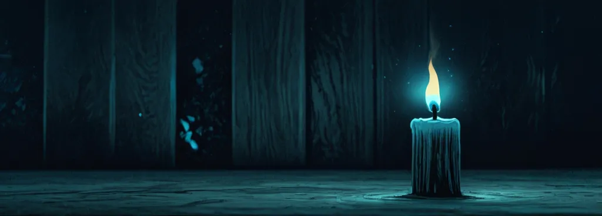
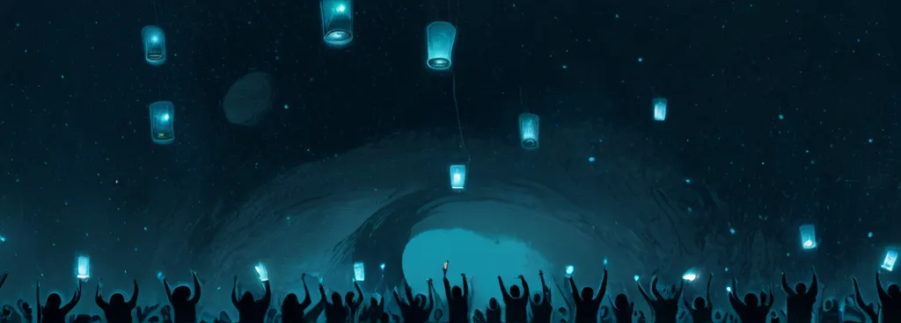
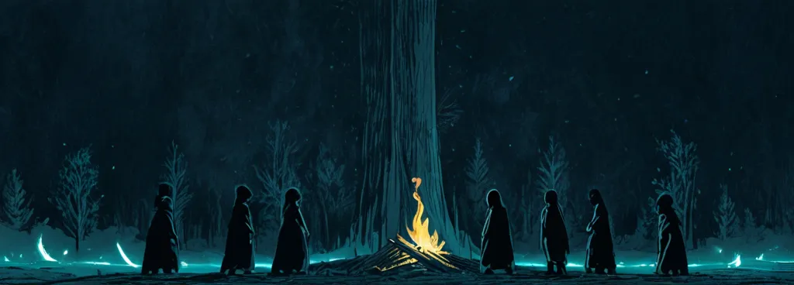
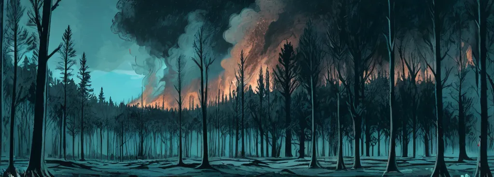
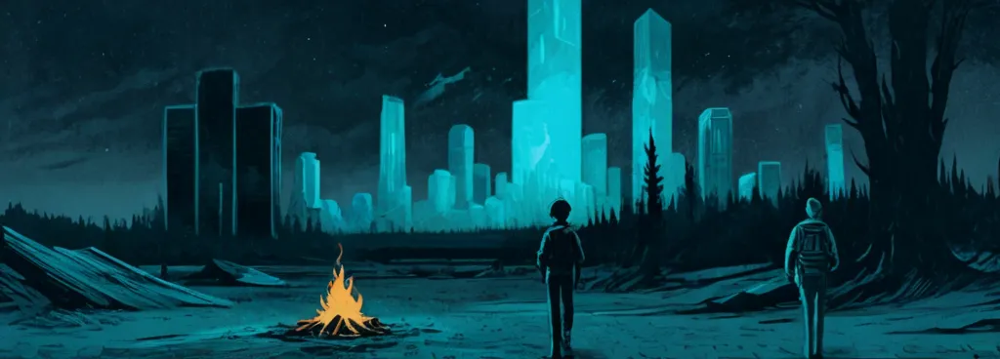
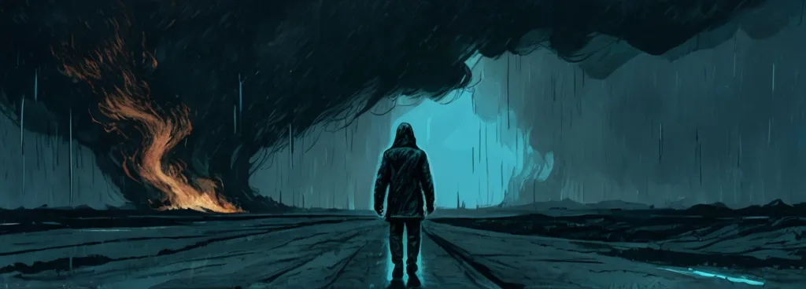
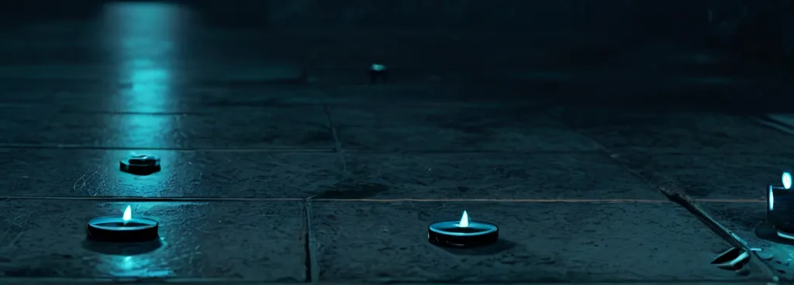
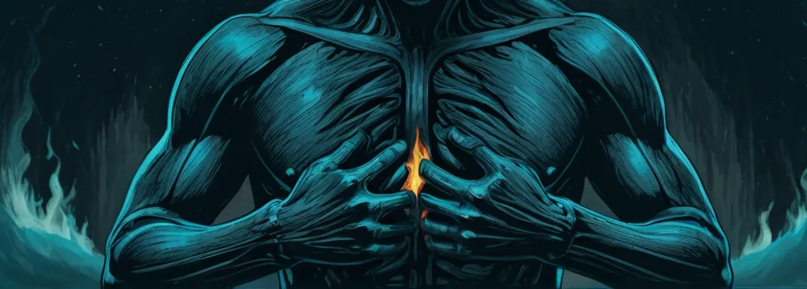
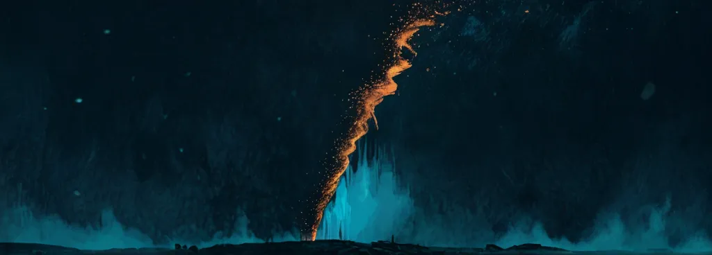
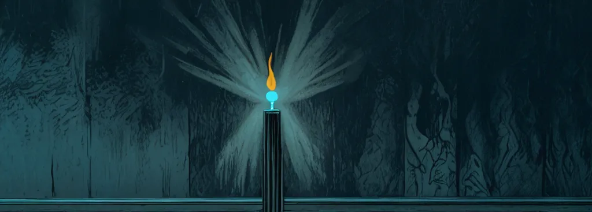

# I gave $64,342 to fund an open-source AI competition. Am I stupid?

Three years ago, I was trying to figure out what to do with my life.

Thankfully, I had saved up some money, and this was around the time AI was hitting the mainstream.

When DALL·E came out, there was obviously a lot to marvel at.

While I also found that extremely impressive, what really left me in **awe** was what happened after Stable Diffusion was released - not just the model itself, but what the community did with it.

Before that, every once in a while you'd see random people do something interesting with visual AI models. But all of a sudden it felt like that flicker had grown into this beautiful roaring fire.

Every day, I'd go on Reddit and see people expanding and extending the model in all kinds of unexpected ways. These weren't experts on paper - just random nerds with no formal credentials, hacking away at something new and groundbreaking.

They were pushing boundaries in ways that felt impossible just weeks before.

It felt like looking through a window at something potentially utopian: people tinkering with cutting-edge AI models on their computers, **sharing their processes and tools for others to learn from and use**, all for the purpose of creating strange, beautiful, interesting art. It wasn't useful for much else.

At this point, I became obsessed. For months, I stayed up all day, every day, trying to get a grip on how this worked—training, prompting, fine-tuning, everything.

For almost all of this time, I struggled without sleep. I had no idea what I was doing.

I therefore realised pretty quickly that I was fairly helpless on my own. Thankfully, there were lots of other people like me, on similar quests.

So I started to build a community of people who were genuinely interested in doing meaningful things with this tech - actually making art, creating new tools, and exploring the space seriously.

That became the Banodoco discord. There was obviously a lot of energy and attention around the degenerate side of this technology, but I wanted to create a space dedicated to the more wholesome, utopian part of it. And it worked!

For the past three years, we've built what I think has been a beautiful place, where talented, driven, motivated people hang out, help each other, and create art together that I find genuinely inspiring.

Over the past few years, many of us have been working on and off to improve the space—building technology, making art, sharing generations, helping other people—and mostly doing it for nothing.

That all sounds pretty utopian, right?

But if it were, I wouldn't be deeply in debt and I probably wouldn't be writing this post.

On the face of it, everything in this space seems fine. We've got great new models, improving technology, more tools, more capabilities.

But as someone who cares deeply about the utopian core of this space - the thing I fell in love with - I feel a growing sense of anxiety about where it's heading.

It's as though the utopian, beautiful ethos that initially inspired me is like a fire that sometimes flares up and sometimes strengthens—but it's driven by a fuel that I sometimes worry is diminishing.

Partly, it's economic. Many people who care about open source still have no real way to sustain their work. So they either compromise, burn out, or in the best case pour themselves into something that gives nothing back.

Partly, it's aesthetic. As soon as these models could create things that look very realistic, the center of gravity shifted there. A lot of the work got less novel, less interesting—too often trying to replicate Hollywood or trying to just use the most powerful model to do the most technically impressive thing.

Partly, it's cultural. Too much energy goes into just testing, benchmarking, and technical one-upmanship for its own sake, instead of using these tools to actually make art. And the main public spaces for this stuff have become overwhelmingly dominated by porn and porn-like things - to the point that one of them has been banned in multiple countries. Often of the most sordid kind.

But part of it is the wasted potential I see in this space. I see so many models, so many paradigms, and so many directions that are basically unexploited—places where people could train something or do something really cool, but it just doesn't happen because people are busy, they lack the compute, or they're just living their lives.

Finally, as these skills became professionally valuable, what started as playful experimentation for many people became work. A lot of talented people got pulled into the closed commercial world.

And the sum of all of this is that every time I see a company that used to open-source its models stop doing that, or every time I see someone who used to do meaningful stuff in this space give up, I can't help feeling that if this space were more vibrant, more exciting, more alive, maybe the calculus behind some of those decisions would be different.

The fire hasn't gone out. But sometimes I feel this anxiety in my belly that it's fading.

I also felt very limited in terms of what I can actually do about any of this.

My goal has been to build an open-source-native company that helps people build tools to help the open ecosystem. And because I wanted to "go all the way" with that, I decided to give away 100% of the company's ownership to people in the community based on their contributions.

I fundamentally think this is the right thing to do for this goal. Unfortunately, from the perspective of many investors I spoke to, it makes the company basically "uninvestable".

I had multiple conversations with people who were interested in what I wanted to do, but only if I'd unwind it, make it more conventional. And I couldn't do that. Not only because I'd made a commitment, but because I knew it would be to accept a compromised version of what I actually wanted to build.

So instead I just kind of struggled on without meaningful resources, without much ability to actually act on what I believe beyond my own time and energy. I'm still not sure if that was the right decision.

So when I woke up the other morning and discovered that Elon had retweeted a project of mine, and that some crypto nerds had therefore created an asset in the name of that project, of which I had somehow earned over $15,000 in fees, I felt like I should try to do something with it.

So, without thinking too much about it, I tweeted that all of it was going to an art competition focused on open-source AI art.

For some reason, this caused a lot of speculative gambling on the asset. People either bought it or sold it based on how they viewed it. A lot of people complained to me that I can't just give it away, that I should spend it on something related to the asset. But all it really resulted in was more gambling. This caused the fees I collected to quadruple to over $60,000. Coincidentally, this is about the amount of debt I've accumulated after eating through my savings.

Today in particular, I feel as though this may be the worst decision of my life—that I've been throwing good money after bad, and that I should have packed it up and been glad that this freak act of luck had neutralized some of my losses.

In either case, someone who's this broke giving this money to an art competition obviously makes no sense.

Firstly, it probably won't have any impact on the space. Even though it's the largest open-source AI art competition ever, it feels like a drop in the ocean.

Secondly, I feel as though people probably just don't care nearly as much as I do - or for various reasons don't want to support it. I posted about the competition on the main Reddit for this space - one whose moderation rules allow it to be mostly populated with soft porn - and the moderators deleted the post, just as they deleted the posts for earlier versions of this competition. Maybe I take that too personally. But then I also clicked into one of my tweets about it, just out of curiosity, to see who from the community had shared it - to find that essentially very few had.

Consider this not my actual opinion but rather my emotional reaction at the time. But it really made me wonder: what am I doing with my life? Why would people not want to support it? Why would you want to delete every post I share about it? Why would you not want this to succeed? Why would you not only not support it but want to actively diminish it? Why am I fucking doing this? Who am I even doing this for?

But while I felt that at the time, it doesn't really capture how I really feel.

Every day I go into the Banodoco Discord and I see a little bit of that flame I fell in love with. And I see that it's still burning there.

I get messages from artists whose work I love - work I haven't seen anything from in as much as a year - telling me that they're making something.

And while many people who contribute here have in various ways given up, I spoke to a friend this morning who's been working in this space for years. He's still doing things, still full of ideas, still pushing it.

I've seen people in the community making really cool things that others can use for their projects - LoRAs, tools, resources. I put some other crypto money I got towards [Art Compute](http://artcompute.org/), which gives people in the community compute to train models - and I see some very talented people already doing some really cool stuff with that.

I see people like Zeev, the CEO of Lightricks, committing to releasing more open models. I see people who are active in our community committing to releasing open models. Lightricks agreed to sponsor our [upcoming event](https://ados.events/). Comfy.org offered to sponsor the competition.

And despite despising crypto for a long time, if I really squint, I can see some way in which crypto can fund open-source stuff that doesn't fit into the conventional capital structure.

So, to answer the question I posed in the headline: yes, I think it was extremely stupid for me to put this money towards this. In fact, I probably should care less about this. I should probably just get a normal job - my mother certainly thinks so.

But despite how I woke up feeling this morning, and what some might see as an objectively dire situation, that isn't what I'm choosing today.

Today, I'm choosing to keep going.

Next week, I'm sharing a tool I've built that aims to unlock the artistic potential of open models - to combine the powerful control they offer with an easy, accessible interface.

A week after that, entries close in the competition and we'll have a public vote. I think there'll be some extraordinary work.

The week after that, I'll launch a new space for people to share resources and art made with open models publicly - one that isn't infested with porn!

And next month, together with our friends at Lightricks, we're having an event in Paris - a chance to bring together the people who care about this space.

Doesn't make it not stupid though.

